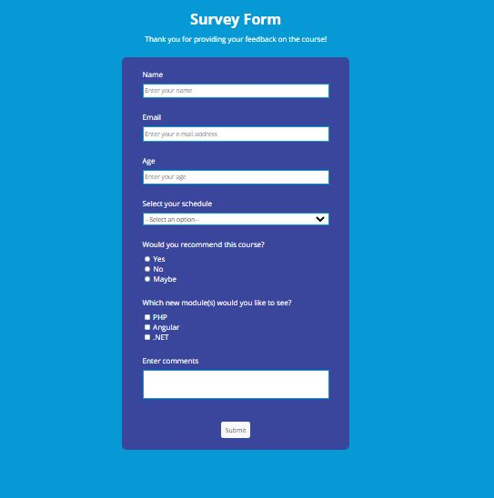

# Microverse project

> this is my first microverse project



Additional description about the project and its features.

## Built With

- Major languages
- html
- css
- javascript

## Getting Started

**This is an example of how you may give instructions on setting up your project locally.**

```
first clone my repository by using this link:https://github.com/Mucyosoda/claude-taibu/tree/admissionTrial
cd Hello-Microverse
Open Vs code then click on Go Live then you will be able to see the code live
```

## Prerequisites

- Text editor
- Git
- Html
- Css
- javascript

## Authors

👤 **Claude Mucyo Ntacyonungutse**

- GitHub: [@githubhandle](https://github.com/Mucyosoda)

## 🤝 Contributing

Contributions, issues, and feature requests are welcome!

Feel free to check the [issues page](../../issues/).

## Show your support

Give a ⭐️ if you like this project!

## Acknowledgments

- Hat tip to anyone whose code was used
- Inspiration
- etc

## 📝 License

This project is [MIT](./MIT.md) licensed.
